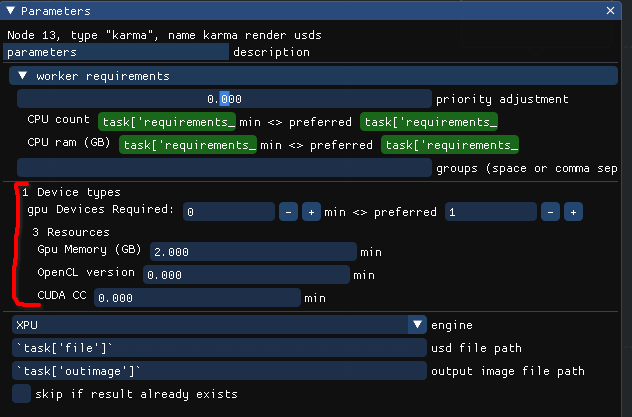

.. _news/post_01:

=======================================================
New Device concept, and how to use your GPUs to the max
=======================================================

A new concept is introduced to Lifeblood - :ref:`Device Resources<device_resources>`

Familiar :ref:`numeric resources<numerical_resources>` are defined only by quantity, by a number,
so that 1.5 CPU cores are exactly same as other 1.5 CPU cores, 2GB of RAM is the same as any other 2GB of RAM.

Devices - are unique resources, that's it. This is an abstract concept, it's not directly tied to any hardware,
again - it is just a unique resource.

Device has a type, a name and it's own set of numeric resources. The set of numeric resources a device can have is defined by it's type.

Abstract example
================

Let's start with an abstract example first, so that you don't assume device can only be one particular thing, such as GPU.

Let's say all our render machines have combustion engines, and we want to use them.

- First, we need to define "engine" device type in scheduler's config

  We will define engine to have the following attributes:

  - horsepower (float)
  - number of cylinders (int)

Now every machine can declare an "engine" device.

For example, let's say

- ``machine1`` has a worker pool running, and in it's worker config it defines that it has a device of type "engine" called "mighty engine" with

  - 1000 horsepowers
  - 8 cylinders

- ``machineB`` also has a worker pool running, and in it's worker config it defines that it has 2 devices of type "engine"

  one called "hefty engine" with

  - 400 horsepowers
  - 4 cylinders

  one "smow emgime" with

  - 200 horsepowers
  - 2 cylinders

As you see, ``machineB`` has 2 devices of the same type, but each of them is unique. Even if they had the same resource values - they would still be treated
as unique: a job cannot just take 1 "engine" as it would take 1 CPU core - it would need to take either specifically first "engine" device, or specifically second.

An Invocation Job may request some number of devices of each type. For example, let's say an invocation requests 1 "engine" device with at least 300 horsepowers
and any number of cylinders.
Scheduler may assign this job to ``machine1`` and give it the only device, or it may assign this job to ``machineB`` and give the job the first "engine"
device, as the second device is not fitting the requirements: it has only 200 horsepowers, but 300 were requested.

Note that the device is given to the job as a whole. Even though ``machine1``'s engine has 800 horsepowers, but only 300 were requested -
the whole engine is given to the job and it's not available any more for any other jobs, until the job it was given to is finished.

How does a job know what devices it was given?
----------------------------------------------

Now that we can assign unique resources to jobs - we should also make that information available to the job itself.

There are 2 major ways of approaching this:

- Make a complicated :ref:`Environment Resolver<environment_resolver_concept>`.

  The component inside the worker that is responsible for actually running payload jobs is environment resolver.
  It is responsible for making sure that you run proper version of softwares and with all the proper plugins.
  For that the resolver is given a set of parameters defined at initial task creation time (at submission time).
  Also the environment resolver is given the resource requirements that the job needs, and it's resolver's job
  to ensure that the job it runs is not allocating more resources than it's given.

  Because of that, environment resolvers are highly platform-dependent, as mechanisms to enforce resource usages are
  very different on, say, windows and linux.

  But theoretically one could implement such an environment resolver that would launch the process in a carefully crafter
  sandbox where only given resources and devices are exposed.

  In such case the payload does not have to be aware of the resources given to it - because the environment resolver has already
  taken care of everything, and payload only "sees" what it is allowed to use.

- Make different payloads aware of resources provided to it, but in a generic way.

  This is the default approach taken by Lifeblood.

  A payload has access to one special python module called ``lifeblood_connection``, through that it can do all sorts of stuff:
  create new tasks, communicate to other invocations through invocation messages (described in earlier posts), and query resources
  assigned to itself.

The first option is relatively complicated, it can be implemented to one particular case, but it's really a lot of work to make it generic.
We will concentrate on how to make the second option work.

So, a payload process can access to resources and devices assigned to it.
Obviously, getting something like a name "hefty engine" is not really helpful, as payload that is supposed to use it has no idea what to do with this name.
Another problem is that different types of payload may use different libraries to work with engines, and may identify them in a completely different way:
one may internally address the same physical engine by some id, like 0, while another library may address the same physical engine by it's internal code or smth,
like "ID:FFB3"

Therefore device tags were introduced.

Tags
++++

Worker can assign any number of tags to any of devices it declares. Scheduler does not know about those tags, so they don't have to adhere to any schemas and
definitions.

Tags are just arbitrary key-value pairs.

Tags for devices can be queried by the payloads through ``lifeblood_connection`` api.

For example, in our engines, ``machineB`` can give the following tags to it's "engine" devices:

- "hefty engine" with

  - ``library_one=0``
  - ``library_neo=ID:FFB3``

- "smow emgime"

  - ``library_one=1``
  - ``library_neo=ID:BEEF``

Now one payload may query "engine" device tags and see that it was given 1 "engine" device.
Since this payload uses library_one - it checks if ``library_one`` tag is set on this device, and it is equal to 1.
Now the payload can easily initialize the library it uses knowing the identification of the engine that that particular library uses.

While another payload that uses, say, library_neo to work with engines, can query for tag named ``library_neo`` and it will be able to use
that device now properly.

With this approach, obviously, Lifeblood nodes that produce payloads that use certain libraries to work with physical hardware
that a particula device type represents (it can actually not represent any hardware at all), have to declare somewhere in it's manual that
they expect "engine" device type to have "library_something" tag that represents this and this.
And as we switch to a concrete example, see how :ref:`karma node<nodes/stock/houdini/karma>` declares that it expects "gpu" device with tag ``karma_dev``,
while other :ref:`houdini nodes<nodes/stock/houdini/hip_driver_renderer>` expect "gpu" device with tag ``opencl_dev`` to properly initialize houdini processes to use the physical GPUs that
those devices represent.

Concrete example
================

Now in reality we usually don't have combustion engines attached to our computers, and even if we do - houdini, karma, arnold, redshift and other softwares
we commonly use do not yet support combustion engines.

But what they do support are GPUs.

By default Lifeblood has a definition for a device type called "gpu", which aims to represent the physical GPU device on a worker machine.

The default definition for a gpu device comes with 3 numerical resources:

- Memory amount
- CUDA Compute Capability (as a float)
- OpenCL maximum version supported (also as a float, this will be changed in the future)

You can see those requirements on any node:

Though scheduler defines "gpu" type device, no worker will have any devices by default,
you will need to add them manually to use them with Lifeblood

.. _how_to_enable_gpu_devices:

How to enable GPU devices for your workers
------------------------------------------

the following you will have to do on each computer that will run Lifeblood Workers.

First of all, locate your worker :ref:`config location<config-dir>`,
you will have to modify the config file located at relative path ``worker/config.toml``

If you have just installed Lifeblood - you will find a commented section like this in the config:

.. code-block:: toml

    # [devices.gpu.gpu1.resources]  # you can name it however you want instead of gpu1
    # # be sure to override these values below with actual ones!
    # mem = "4G"
    # opencl_ver = 3.0
    # cuda_cc = 5.0
    # [devices.gpu.gpu1.tags]
    # houdini_ocl = "GPU::0"
    # karma_dev = "0/1"

This section hints you how to add your own device.

Let's uncomment it and see what's going on:

.. code-block:: toml

    [devices.gpu.gpu1.resources]
    mem = "4G"
    opencl_ver = 3.0
    cuda_cc = 5.0

    [devices.gpu.gpu1.tags]
    houdini_ocl = "GPU::0"
    karma_dev = "0/1"

line ``[devices.gpu.gpu1.resources]`` defines device type ``gpu`` with name ``gpu1``

You can use ANY name you like, as long as it's a unique name.

In this ``resources`` subsection we must define resources according to the gpu device schema.

- ``mem`` is just GPU memory. you can specify it in bytes, or, much more conveniently,
  as a string like "12G" meaning 12 GB of memory
- ``opencl_ver`` is the maximum opencl version supported by the device/drivers.

  The easiest way to obtain this number is to check you GPU's specification.
  Assuming you have the latest device drivers - that is what your device will support.

  on linux machines you can also run ``clinfo`` and check the line ``Device Version`` or ``Platform Version``.
  You will see something like ``Device Version                                  OpenCL 3.0 CUDA``
  which means you need to put ``opencl_ver = 3.0`` in the config
- ``cuda_cc`` is  the CUDA Compute Capability supported by your device.
  It is easies to obtain it from Nvidia device specification page.

  .. note::

    on linux you will have to use proprietary Nvidia drivers to be able to use CUDA

Next is the Tags section. line ``[devices.gpu.gpu1.tags]`` starts ``tags`` section for
device named ``gpu1`` of type ``gpu``

Use the same device name you used to in the resources declaration section above.

these tags contain some specific information that help identify this particular device
for different DCCs and libraries.

Even within houdini there are 2 independent ways a device needs to be identified for different components:
main houdini's OpenCL-based computation engine uses vendor name and device number to identify GPU, while
karma uses optix device number to identify GPU.

You can find descriptions for the tags used by nodes in their manuals
:ref:`karma node<nodes/stock/houdini/karma>` and :ref:`houdini nodes<nodes/stock/houdini/hip_driver_renderer>`

So, tag ``houdini_ocl`` is used by all houdini-related nodes, and tag ``karma_dev`` is used by karma

How find values for those ``houdini_ocl`` and ``karma_dev`` tags
________________________________________________________________

OpenCL device for simulations
+++++++++++++++++++++++++++++

As you could see in the node manual, ``houdini_ocl`` tag consists of 3 parts separated by ``:`` sign.

those are ``<TYPE>:<VENDOR>:<NUMBER>``

Any one part may be empty, in that case you are leaving it up to houdini to pick a value, which is **NOT** what you want
if the value is ambiguous

To get the values you can run ``hgpuinfo -cl``. This will list all OpenCL devices usable by Houdini.
the ``OpenCL Type`` corresponds to ``<TYPE>``, and ``Platform Vendor`` corresponds to ``<VENDOR>``.
Unfortunately there is no clear field that corresponds to ``<NUMBER>``.

Different devices from different GPU vendors
............................................

If you have GPUs from different vendors - it is not a problem, as you can leave the ``<NUMBER>`` blank and
there will not be any ambiguity, for example,

.. code-block:: toml

    [devices.gpu.gpu1.tags]
    houdini_ocl = "GPU:NVIDIA Corporation"

    [devices.gpu.gpu2.tags]
    houdini_ocl = "GPU:Intel(R) Corporation"

Different devices from same GPU vendor
......................................

If you have 2 different GPUs from the same vendor - you might be able to tell them apart by the output of ``hgpuinfo -cl``,
and additionaly provide ``<NUMBER>`` based on the ordering of the output, grouped by **type**, for example:

- OpenCL Type: CPU
- OpenCL Type: GPU, Vendor: AMD
- OpenCL Type: GPU, Vendor: Nvidia (has ``<NUMBER>`` **0**)
- OpenCL Type: GPU, Vendor: Nvidia (has ``<NUMBER>`` **1**)

Identical devices from same GPU vendor
......................................

If you have 2 (or more) identical GPUs from the same vendor - there is no way of telling which device from ``hgpuinfo -cl``
output corresponds to which physical device.

The only way to determine which physical GPU device corresponds to which houdini ocl device is to set it up, run some load
and check which GPU is being loaded in some 3rd party monitoring tool.

For example, if you have 2 Nvidia GTX 4090 - you can open up a terminal and set up environment variables like this:

.. code-block:: bash

    export HOUDINI_OCL_DEVICETYPE=GPU
    export HOUDINI_OCL_VENDOR="NVIDIA Corporation"
    export HOUDINI_OCL_DEVICENUMBER=0

    houdini -foreground

Now you will have to run some vellum simulation, or pyro minimal solver, or anything else that puts some load on the OpenCL device
and check with some monitoring tools which GPU is being loaded.

After that you can replace ``HOUDINI_OCL_DEVICENUMBER=0`` with ``HOUDINI_OCL_DEVICENUMBER=1`` in the snippet above and perform the same
test to check what device number 1 corresponds to.

This is very tedious, yes, but unfortunately SideFX does not provide any better tools for this.

Karma Optix device for rendering
++++++++++++++++++++++++++++++++

If you are planning to render with Karma XPU and manage GPU devices with Lifeblood - you have to provide ``karma_dev`` tag for your gpu devices.

Unfortunately, SideFX did not provide any tools for detecting what optix device corresponds to what physical GPU.

Therefore the only way to determine that is to disable one Optix device at a time and checking (with karma or external monitoring tools) which
GPU device stopped rendering.

To do that - you need to open up a terminal and set up additional environment before starting houdini

.. code-block:: bash

    export KARMA_XPU_DISABLE_DEVICE_0=1

    houdini -foreground

This will disable optix device 0 - you will need to set up some test XPU render to determine which Optix device is not being loaded with work.

To test another device you need to close houdini and restart it with setting ``KARMA_XPU_DISABLE_DEVICE_1`` instead of ``KARMA_XPU_DISABLE_DEVICE_0`` (and so on)

When you get what number corresponds to what GPU on your machine - you can add that information to gpu tags, like

.. code-block:: toml

    [devices.gpu.gpu1.tags]
    karma_dev = "1/2"

    [devices.gpu.gpu2.tags]
    karma_dev = "0/2"

where ``"1/2"`` means Optix device number 1 out of 2 GPU Optix devices in total.

Example config look
+++++++++++++++++++

After all the values were determined, your config would look something like this, in case you have, for example,
3 GPUs: 2 identical from Nvidia, and one from Intel

.. code-block:: toml

    [devices.gpu.arc_thingie.tags]
    houdini_ocl = "GPU:Intel(R) Corporation"

    [devices.gpu.nvidia_4090_1.tags]
    karma_dev = "0/2"
    houdini_ocl = "GPU:NVIDIA Corporation:1"

    [devices.gpu.nvidia_4090_2.tags]
    karma_dev = "1/2"
    houdini_ocl = "GPU:NVIDIA Corporation:0"

Note, here we assume that Karma did not detect intel GPU as a valid optix device, therefore it does not have a ``karma_dev`` tag
